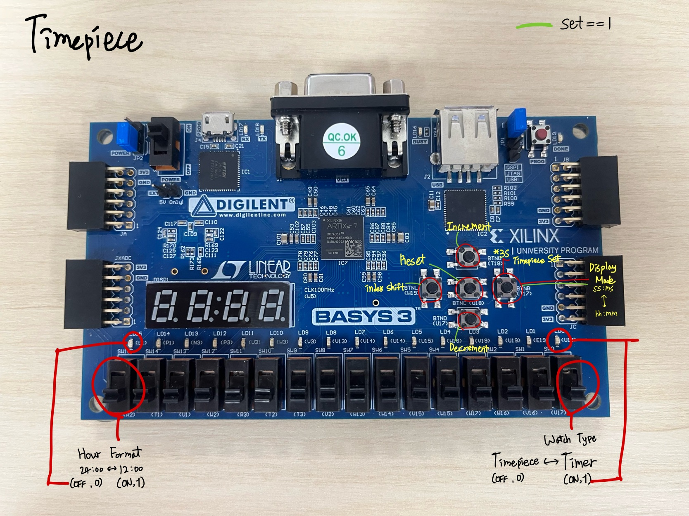
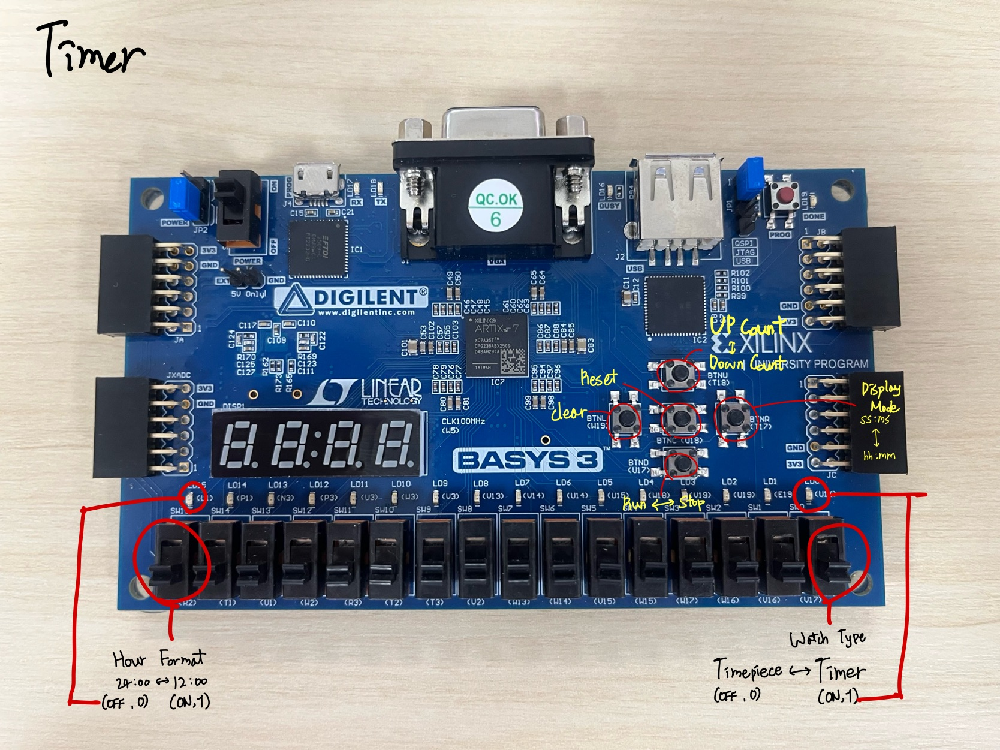

# 1. User Interface Requirement

 

본 요구사항은 Digilent Basys 3 보드 기반 Timepiece / Timer 시스템의 실제 물리 인터페이스 구성을 기준으로 정의한다.

## 1.1. 사용자 조작 요구사항

| ID    | 사용자 요구사항  | 설명                                             |
| ----- | --------- | ---------------------------------------------- |
| UR-01 | 모드 전환 가능  | 사용자는 스위치를 통해 Timepiece와 Timer 모드를 선택할 수 있어야 한다 |
| UR-02 | 시간 포맷 선택  | 사용자는 24h / 12h 형식을 선택할 수 있어야 한다                |
| UR-03 | 표시 형식 전환  | 사용자는 HH:MM ↔ SS:MS 표시 형식을 전환할 수 있어야 한다         |
| UR-04 | 시간 값 수정   | 사용자는 Timepiece 모드에서 시간 값을 수정할 수 있어야 한다         |
| UR-05 | 수정 대상 선택  | 사용자는 시 또는 분 위치를 선택할 수 있어야 한다                   |
| UR-06 | 값 증가/감소   | 사용자는 선택된 값을 증가 또는 감소시킬 수 있어야 한다                |
| UR-07 | 시간 초기화    | 사용자는 시간 값을 초기화할 수 있어야 한다                       |
| UR-08 | 타이머 설정    | 사용자는 Timer 초기 값을 설정할 수 있어야 한다                  |
| UR-09 | 카운트 방향 선택 | 사용자는 증가 또는 감소 카운트를 선택할 수 있어야 한다                |
| UR-10 | 타이머 실행/정지 | 사용자는 Timer 동작을 시작 또는 정지할 수 있어야 한다              |
| UR-11 | 타이머 값 초기화 | 사용자는 Timer 현재 값을 초기화할 수 있어야 한다                 |
| UR-12 | 전체 상태 초기화 | 사용자는 시스템 전체를 초기 상태로 복귀시킬 수 있어야 한다              |
| UR-13 | 상태 확인 가능  | 사용자는 디스플레이를 통해 현재 상태를 확인할 수 있어야 한다             |
| UR-14 | 직관적 물리 조작 | 사용자는 스위치와 버튼만으로 모든 기능을 수행할 수 있어야 한다            |

---

# 2. Functional Requirements

사진에 표시된 스위치 및 버튼 매핑을 기준으로 시스템 동작을 구체화한다.

---

## 2.1. 입력 장치 매핑

| ID    | 기능 요구사항         | 입력 장치       | 설명                         |
| ----- | --------------- | ----------- | -------------------------- |
| FR-01 | 모드 선택 기능        | 우측 슬라이드 스위치 | OFF: Timepiece / ON: Timer |
| FR-02 | 시간 포맷 설정        | 좌측 슬라이드 스위치 | OFF: 24h / ON: 12h         |
| FR-03 | Display Mode 전환 | BTN (우측 버튼) | HH:MM ↔ SS:MS 전환           |

---

## 2.2. Timepiece 모드 기능

| ID    | 기능 요구사항        | 입력                | 설명                  |
| ----- | -------------- | ----------------- | ------------------- |
| FR-10 | Index Shift 기능 | BTN (Index Shift) | 수정 대상 자리 이동 (시 ↔ 분) |
| FR-11 | 값 증가 기능        | BTN (Increment)   | 선택된 시간 값 증가         |
| FR-12 | 값 감소 기능        | BTN (Decrement)   | 선택된 시간 값 감소         |
| FR-13 | Reset 기능       | BTN (Reset)       | 전체 시간 초기화           |
| FR-14 | 실시간 카운트        | 내부 클럭             | 1초 단위 시간 증가         |
| FR-15 | 포맷 기반 표시       | Display           | 12h/24h 형식 반영       |

---

## 2.3. Timer 모드 기능

| ID    | 기능 요구사항       | 입력               | 설명                 |
| ----- | ------------- | ---------------- | ------------------ |
| FR-20 | Up Count 설정   | BTN (Up Count)   | 증가 카운트 설정          |
| FR-21 | Down Count 설정 | BTN (Down Count) | 감소 카운트 설정          |
| FR-22 | Run/Stop 제어   | BTN (Run/Stop)   | 타이머 실행 및 정지        |
| FR-23 | Clear 기능      | BTN (Clear)      | 현재 카운트 값 초기화       |
| FR-24 | Reset 기능      | BTN (Reset)      | 전체 상태 초기화          |
| FR-25 | 카운트 수행        | 내부 클럭            | 설정된 방향으로 카운트 수행    |
| FR-26 | 종료 조건 처리      | 내부 로직            | 0 도달 시 정지 또는 상태 전환 |

---

## 2.4. 디스플레이 기능

| ID    | 기능 요구사항      | 설명                      |
| ----- | ------------ | ----------------------- |
| FR-30 | 7-Segment 출력 | 4-digit 디스플레이 사용        |
| FR-31 | HH:MM 표시     | 시/분 표시                  |
| FR-32 | SS:MS 표시     | 초/밀리초 표시                |
| FR-33 | 모드 반영 표시     | Timepiece / Timer 상태 반영 |
| FR-34 | 값 갱신 반영      | 입력 또는 카운트 변경 시 즉시 업데이트  |

---

## 2.5. 상태 제어 및 입력 처리

| ID    | 기능 요구사항     | 설명                         |
| ----- | ----------- | -------------------------- |
| FR-40 | 버튼 디바운싱     | 안정적인 입력 처리                 |
| FR-41 | 단일 이벤트 처리   | 버튼 입력은 1회 이벤트로 처리          |
| FR-42 | 모드별 기능 분기   | 동일 버튼의 기능을 모드에 따라 재정의      |
| FR-43 | 입력 우선순위 처리  | 동시 입력 시 우선순위 적용            |
| FR-44 | 상태 머신 기반 제어 | Timepiece / Timer 상태 분리 관리 |

---

## 2.6. User ↔ Function Traceability

| User Requirement | Functional Requirement |
| ---------------- | ---------------------- |
| UR-01            | FR-01                  |
| UR-02            | FR-02                  |
| UR-03            | FR-03, FR-31, FR-32    |
| UR-04            | FR-10, FR-11, FR-12    |
| UR-05            | FR-10                  |
| UR-06            | FR-11, FR-12           |
| UR-07            | FR-13                  |
| UR-08            | FR-20, FR-21           |
| UR-09            | FR-20, FR-21           |
| UR-10            | FR-22                  |
| UR-11            | FR-23                  |
| UR-12            | FR-24                  |
| UR-13            | FR-30~FR-34            |
| UR-14            | FR-01~FR-44            |

